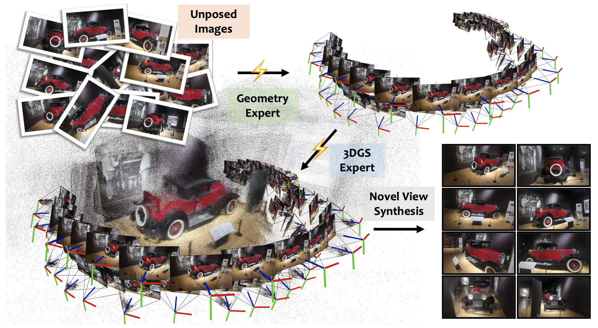

<div align="center">
<h1>2plat: Two Experts Are Better Than One Generalist</h1>

 [Hwasik Jeong](https://github.com/HwasikJeong), [Seungryong Lee](https://github.com/sngryongLee), [Gyeongjin Kang](https://gynjn.github.io/info/), [Seungkwon Yang](https://github.com/yang-gwon2), [Xiangyu Sun](https://github.com/Xiangyu1Sun), [Seungtae Nam](https://github.com/stnamjef), [Eunbyung Park](https://silverbottlep.github.io/index.html)
</div>

<div align="center" style="margin-top: 2em; margin-bottom: 1.0em">
  <a href="https://arxiv.org/abs/2603.21064"></a> <a href="https://hwasikjeong.github.io/2Xplat/"></a> <a href="https://huggingface.co/spaces/HwasikJeong/2Xplat"></a>
</div>

<div align="center" style="margin-top: 5.0em; margin-bottom: 1.0em">
  
</div>


## Installation

```bash
# 1. Clone the repository
git clone https://github.com/HwasikJeong/2Xplat.git

# 2. Create and activate conda environment
conda create -n 2xplat python=3.12 -y
conda activate 2xplat

# 3. Install dependencies (adjust PyTorch and CUDA version to match your system)
pip install torch==2.10.0 torchvision==0.25.0 torchaudio==2.10.0 --index-url https://download.pytorch.org/whl/cu130
pip install -r requirements.txt

# 4. gsplat: intrinsic gradient version
pip install git+https://github.com/QitaoZhao/gsplat.git --no-build-isolation
```

## Checkpoints
We provide some relevant checkpoints on [huggingface🤗](https://huggingface.co/HwasikJeong/2Xplat). Checkpoints should be organized as follows:
```
path/to/2Xplat/pretrained_weights/
├── 2xplat_dl3dv_lr.pt # 2Xplat-G 
├── 2xplat_large_dl3dv_lr.pt # 2Xplat-L 
├── da3_giant.safetensors # geometry expert (DA3-G)
├── da3_large.safetensors # geometry expert (DA3-L)
└── mvp_dl3dv_lr.pt # appearance expert (MVP)
```

## Datasets
You can download the DL3DV datasets from the [official repository](https://huggingface.co/DL3DV). We use **DL3DV-ALL-480P** for low-resolution training/inference and **DL3DV-ALL-960P** for high-resolution training/inference.

After downloading the datasets, update the paths in `src/data/dl3dv_test.txt` and `src/data/dl3dv_train.txt` to point to your local dataset locations.

## Inference
Before running the inference code, first update all the paths in `src/data/dl3dv_test.txt` and download [2Xplat checkpoint](https://huggingface.co/HwasikJeong/2Xplat/resolve/main/2xplat_dl3dv_lr.pt) as done in [previous section](#datasets). Then, review the available configuration options in the table below.
| Option | Description |
| ------ | ----------- |
| `json_path` | Path to the DL3DV benchmark context/target view configuration. See the `src/data/dl3dv_start_*.json` files. |
| `num_input_frames` | Number of context views. Must be consistent with `json_path`. |
| `camera_mode` | Whether to use the predicted pose or the ground-truth (GT) pose. |
| `pose_optimization` | Whether to use evaluation-time pose alignment (EPA). |
| `visualize` | Whether to visualize the ground-truth and rendered images. |

Then, run the inference code using following command:
```
# inference DL3DV 224x224
python -m src.commands.inference --config src/configs/inference.yaml
```

## Train
If you want to train 2Xplat framework, you first need to update all the paths in `src/data/dl3dv_train` explained [before](#datasets), then download two experts' checkpoints: [geometry expert (DA3)](https://huggingface.co/depth-anything/DA3-GIANT-1.1/resolve/main/model.safetensors) and [appearance expert (MVP)](https://huggingface.co/HwasikJeong/2Xplat/resolve/main/mvp_dl3dv_lr.pt), and organize them as shown in [here](#checkpoints).

Then, run the following command:
```
# train DL3DV 224x224
CUDA_VISIBLE_DEVICES=0,1,2,3,4,5,6,7 torchrun --nproc_per_node 8 --nnodes 1 -m src.commands.train --config src/configs/train_update_dynamic.yaml
```

## Acknowledgement
Our project is based on the following awesome repositories:
- [Long-LRM](https://github.com/arthurhero/Long-LRM)
- [MVP](https://github.com/Gynjn/MVP)
- [Depth Anything 3](https://github.com/ByteDance-Seed/depth-anything-3)
- [YoNoSplat](https://github.com/cvg/yonosplat)

Thanks for releasing code!!!

## Citation

If you find our work useful, please cite:

```bibtex
@article{jeong2026twoxplat,
          title={2Xplat: Two Experts Are Better Than One Generalist},
          author={Hwasik Jeong and Seungryong Lee and and Gyeongjin Kang and Seungkwon Yang and Xiangyu Sun and Seungtae Nam and Eunbyung Park},
          journal={arXiv preprint arXiv:2603.21064},
          year={2026}
}
```
